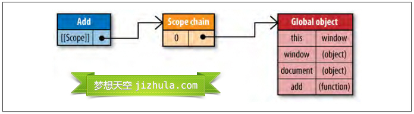
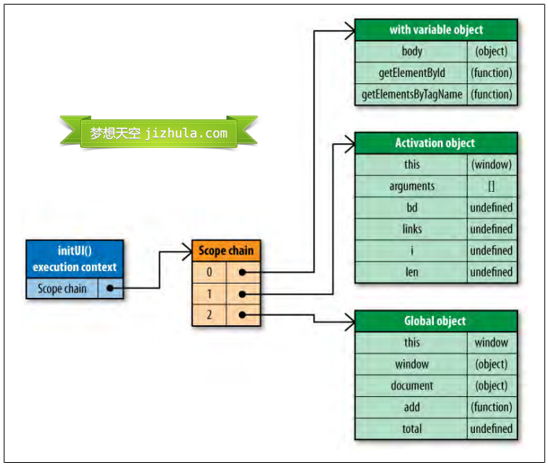
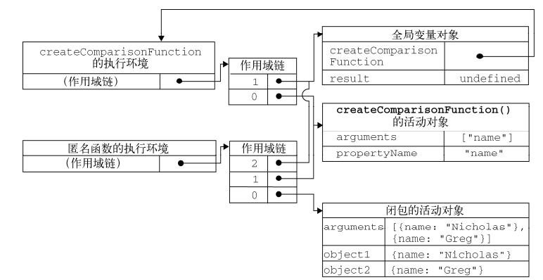

********
执行环境和作用域
********

    Javascript声明变量的时候，虽然用 ``var`` 关键字声明和不用关键字声明，很多时候运行并没有问题，但是这两种方式还是有区别的。可以正常运行的代码并不代表是合适的代码。

    .. code-block:: javascript

        var num = 1;

    是在当前域中声明变量。 **如果在方法中声明，则为局部变量（local variable）；如果是在全局域中声明，则为全局变量。** 而 ``num = 1；`` 事实上是对属性赋值操作。首先，它会尝试在当前作用域链（如在方法中声明，则当前作用域链代表全局作用域和方法局部作用域）中解析 ``num`` ； 如果在任何当前作用域链中找到 ``num`` ，则会执行对 ``num`` 属性赋值； 如果没有找到 ``num`` ，它才会在全局对象（即当前作用域链的最顶层对象，如 ``window`` 对象）中创造 ``num`` 属性并赋值。

    注意！ **它并不是声明了一个全局变量，而是创建了一个全局对象的属性。**

    即便如此，可能你还是很难明白“变量声明”跟“创建对象属性”在这里的区别。事实上，Javascript的变量声明、创建属性以及每个Javascript中的每个属性都有一定的标志说明它们的属性----如只读（ReadOnly）不可枚举（DontEnum）不可删除（DontDelete）等等。

    由于变量声明自带不可删除属性，比较 ``var num = 1`` 跟 ``num = 1`` ，前者是变量声明，带不可删除属性，因此无法被删除；后者为全局变量的一个属性，因此可以从全局变量中删除。

    .. code-block:: javascript

        // num1为全局变量，num2为window的一个属性
        var num1 = 1;
        num2 = 2;
        // delete num1;  无法删除
        // delete num2;  删除
        function model() {
            var num1 = 1; // 本地变量
            num2 = 2; // window的属性
            // 匿名函数
            (function() {
                var num = 1; // 本地变量
                num1 = 2; // 继承作用域（闭包）
                num3 = 3; // window的属性
            }())
        }

    在ECMAScript5标准中，有一种“严格模式”（Strict Mode）。在严格模式中，为未声明的标识符赋值将会抛引用错误，因此可以防止意外的全局变量属性的创造。目前一些浏览器的新版本已经支持。

JavaScript作用域
================
任何程序设计语言都有作用域的概念，简单的说，作用域就是变量与函数的可访问范围，即作用域控制着变量与函数的可见性和生命周期。在JavaScript中，变量的作用域有全局作用域和局部作用域两种。

全局作用域（Global Scope）
-------------------------
在代码中任何地方都能访问到的对象拥有全局作用域，一般来说以下几种情形拥有全局作用域：

1. 最外层函数和在最外层函数外面定义的变量拥有全局作用域，例如：

   .. code-block:: javascript

    var authorName="山边小溪";
    function doSomething(){
        var blogName="梦想天空";
        function innerSay(){
            alert(blogName);
        }
        innerSay();
    }
    alert(authorName); //山边小溪
    alert(blogName); //脚本错误
    doSomething(); //梦想天空
    innerSay() //脚本错误

2. 所有末定义直接赋值的变量自动声明为拥有全局作用域，例如：

   .. code-block:: javascript

    function doSomething(){
        var authorName="山边小溪";
        blogName="梦想天空";
        alert(authorName);
    }
    doSomething(); //山边小溪
    alert(blogName); //梦想天空
    alert(authorName); //脚本错误

   变量 ``blogName`` 拥有全局作用域，而 ``authorName`` 在函数外部无法访问到。

3. 所有window对象的属性拥有全局作用域

   一般情况下，window对象的内置属性都拥有全局作用域，例如window.name、window.location、window.top等等。

局部作用域（Local Scope）
------------------------
和全局作用域相反，局部作用域一般只在固定的代码片段内可访问到，最常见的例如函数内部，所有在一些地方也会看到有人把这种作用域称为函数作用域，例如下列代码中的 ``blogName`` 和函数 ``innerSay`` 都只拥有局部作用域。

.. code-block:: javascript

    function doSomething(){
        var blogName="梦想天空";
        function innerSay(){
            alert(blogName);
        }
        innerSay();
    }
    alert(blogName); //脚本错误
    innerSay(); //脚本错误

作用域链（Scope Chain）
=======================
在JavaScript中，函数也是对象，实际上，JavaScript里一切都是对象。函数对象和其它对象一样，拥有可以通过代码访问的属性和一系列仅供JavaScript引擎访问的内部属性。其中一个内部属性是 ``[[Scope]]`` ，由ECMA-262标准第三版定义， **该内部属性包含了函数被创建的作用域中对象的集合** ，这个集合被称为 **函数的作用域链** ，它决定了哪些数据能被函数访问。

当一个函数创建后，它的作用域链会被创建此函数的作用域中可访问的数据对象填充。例如定义下面这样一个函数：

.. code-block:: javascript

    function add(num1,num2) {
        var sum = num1 + num2;
        return sum;
    }

在函数 ``add`` 创建时，它的作用域链中会填入一个全局对象，该全局对象包含了所有全局变量，如下图所示（注意：图片只例举了全部变量中的一部分）：

函数add的作用域将会在执行时用到。例如执行如下代码：

.. code-block:: javascript

    var total = add(5,10);

执行此函数时会创建一个称为“执行环境(execution context)”的内部对象，执行环境定义了函数执行时的环境。每个执行环境都有自己的作用域链，用于标识符解析。

1. 当执行环境被创建时(就是调用函数时)，而它的作用域链初始化为当前运行函数的 ``[[Scope]]`` 所包含的对象。

2. 此时执行流进入函数，函数内部这些值(参数，定义局部变量等等)按照它们出现在函数中的顺序被复制到执行环境的作用域链中。它们共同组成了一个新的对象，叫“ **活动对象(activation object)** ”，该对象包含了函数的所有局部变量、命名参数、参数集合以及 ``this`` ，然后此对象会被推入作用域链的前端，当执行环境被销毁，活动对象也随之销毁。新的作用域链如下图所示：

.. image:: ./images/add-1.jpg

在函数执行过程中，每遇到一个变量，都会经历一次标识符解析过程以决定从哪里获取和存储数据。该过程从作用域链头部，也就是从活动对象开始搜索，查找同名的标识符，如果找到了就使用这个标识符对应的变量，如果没找到继续搜索作用域链中的下一个对象，如果搜索完所有对象都未找到，则认为该标识符未定义。函数执行过程中，每个标识符都要经历这样的搜索过程。

当代码在一个环境中执行时，会创建变量对象的一个作用域链。作用域链的用途是保证对执行环境有权访问的所有变量和函数的有序访问。作用域链的前端始终是当前执行的代码所在环境的变量对象。如果这个环境是函数，则将其活动对象作为变量对象。活动对象在最开始时只包含一个变量，即 ``arguments`` 对象。作用域链的下一个变量对象来自包含环境，而在下一个变量对象则来自下一个包含环境。这样一直延续到全局执行环境；全局执行环境的变量对象始终都是作用域链中的最后一个对象。 **作用域链本质上是一个指向变量对象的指针列表，它只引用但不实际包含变量对象。**

​作用域链（scope chain）的生成跟执行环境（execution context）、变量对象(Variable Object）、函数对象（function object）和活动对象（activation object）紧密相关。

执行环境
--------
执行环境是JavaScript中最为重要的一个概念。执行函数定义了变量或函数有权访问的其它数据，决定了它们各自的行为。每个执行环境都有一个与之关联的变量对象（variable object）和一个作用域链（scope chain），环境中定义的所有变量和函数都保存在其变量对象中。执行环境分为两种，一种是全局执行环境，一种是函数执行环境。

全局执行环境
^^^^^^^^^^^^^
​全局执行环境是最外围的一个执行环境。在Web浏览器中，全局执行环境被认为是window对象，因此所有全局变量和函数都是作为window对象的属性和方法创建的。某个执行环境中的所有代码执行完毕后，该环境被销毁，保存在其中的所有变量和函数定义也随之销毁（全局执行环境知道应用程序退出–例如关闭网页或浏览器—时才会被销毁）。

函数执行环境
^^^^^^^^^^^^
​每个函数都有自己的执行环境。当执行流进入一个函数时，函数环境就会被推入一个环境栈中。当函数执行完之后，栈将其环境弹出，把控制权返回给之前的执行环境。函数执行环境的变量对象是该函数的活动对象（activation object）。

执行环境的建立分为两个阶段：进入执行上下文（创建阶段）和执行阶段（激活/执行阶段）

1. 进入上下文阶段：发生在函数调用时，但在执行具体代码之前。具体完成创建作用域链；创建变量、函数和参数以及求this的值

   - 初始化作用域链：
   - 创建变量对象：
   - 创建arguments对象，检查上下文，初始化参数名称和值并创建引用的复制。
   - 扫描上下文的函数声明：为发现的每一个函数，在变量对象上创建一个属性（确切的说是函数的名字），其有一个指向函数在内存中的引用。如果函数的名字已经存在，引用指针将被重写。
   - 扫面上下文的变量声明：为发现的每个变量声明，在变量对象上创建一个属性——就是变量的名字，并且将变量的值初始化为undefined，如果变量的名字已经在变量对象里存在，将不会进行任何操作并继续扫描。
   - 求出上下文内部“this”的值。
2. 执行代码阶段：主要完成变量赋值、函数引用和解释/执行其他代码;

总的来说可以将执行上下文看作是一个对象。

.. code-block:: javascript

    EC = { // EC为执行环境
        VO:{/*函数中的arguments对象、参数、内部变量以及函数声明*/}
        this:{},
        Scope:{/*VO以及所有父执行上下文中的VO*/}
    }

变量对象
---------
每一个执行环境都对应一个变量对象，在该执行环境中定义的所有变量和函数都存放在其对应的变量对象中。每个执行环境都有一个表示变量的对象——变量对象。 **全局环境的变量对象始终存在，而像compare()函数这样的局部环境的变量对象，则只在函数执行的过程中存在。** 在创建 ``compare()`` 函数时，会创建一个预先包含全局变量对象的作用域链，这个作用域链会被保存在内部的 ``[[Scope]]`` 属性中。当调用 ``compare()`` 函数时，会为函数创建一个执行环境，然后通过赋值函数的 ``[[Scope]]`` 属性中的对象构建起执行环境的作用域链。

1. 进入执行上下文时，VO的初始化过程如下：
   - 函数的形参：变量对象的一个属性，其属性名就是形参的名字，其值就是实参的值；对于没有传递的参数，其值为undefined；
   - 函数声明：变量对象的一个属性，其属性名和属性值都是函数对象创建出来的，如果变量对象已经办好了相同名字的属性，则替换它的值；
   - 变量声明：变量对象的一个属性，其属性名即为变量名，其值为undefined；如果变量名和已经声明的函数名或者函数的参数名，则不会影响已经存在的属性；
2. 执行代码阶段，变量对象中的一些属性undefined值将会确定。

作用域链
---------
对于每一个执行环境，都会创建一个与之关联的作用域链。每个执行环境的作用域链的前端，始终都是该执行环境的变量对象，对于全局执行环境就相当于window对象，对于函数执行环境就相当于该函数的活动对象；对于全局执行环境，已经是根部，没有后续，对于函数执行环境，其作用域链的后续是该函数对象的 ``[[scope]]`` 属性里的作用域链。

函数对象
---------
​在一个函数定义被执行的时候， 会创建一个这个函数对象的 ``[[scope]]`` 属性（内部属性,只有JS引擎可以访问, 但FireFox的几个引擎（SpiderMonkey和Rhino）提供了私有属性 ``__parent__`` 来访问它)，并将这个 ``[[scope]]`` 属性指向定义它的作用域链上。

活动对象
--------
​在一个函数对象被调用的时候，会创建一个活动对象，首先将该函数的每个形参和实参，都添加为该活动对象的属性和值；将该函数体内显式声明的变量和函数，也添加为该活动的的属性（在刚进入该函数执行环境时，未赋值，所以值为undefined， **这个是JS的提前声明机制，会声明变量可不会赋值** ）。 换句话说，活动对象除了变量和函数声明之外，它还存储了形参和arguments对象。

​然后将这个活动对象做为该函数执行环境的作用域链的最前端，并将这个函数对象的 ``[[scope]]`` 属性里作用域链接入到该函数执行环境作用域链的后端。

**注意：函数的** ``[[scope]]`` **为执行该函数定义代码时环境的作用域链**

作用域链和代码优化
==================
从作用域链的结构可以看出，在执行环境的作用域链中，标识符所在的位置越深，读写速度就会越慢。如上图所示，因为全局变量总是存在于执行环境作用域链的最末端，因此在标识符解析的时候，查找全局变量是最慢的。所以，在编写代码的时候应尽量少使用全局变量，尽可能使用局部变量。一个好的经验法则是：如果一个跨作用域的对象被引用了一次以上，则先把它存储到局部变量里再使用。例如下面的代码：

.. code-block:: javascript

    function changeColor(){
        document.getElementById("btnChange").onclick=function(){
            document.getElementById("targetCanvas").style.backgroundColor="red";
        };
    }

这个函数引用了两次全局变量document，查找该变量必须遍历整个作用域链，直到最后在全局对象中才能找到。这段代码可以重写如下：

.. code-block:: javascript

    function changeColor(){
        var doc=document;
        doc.getElementById("btnChange").onclick=function(){
            doc.getElementById("targetCanvas").style.backgroundColor="red";
        };
    }

这段代码比较简单，重写后不会显示出巨大的性能提升，但是如果程序中有大量的全局变量被从反复访问，那么重写后的代码性能会有显著改善。

改变作用域链
============
函数每次执行时对应的执行环境都是独一无二的，所以多次调用同一个函数就会导致创建多个执行环境，当函数执行完毕，执行上下文会被销毁。每一个执行环境都和一个作用域链关联。一般情况下，在执行环境运行的过程中，其作用域链只会被 ``with`` 语句和 ``catch`` 语句影响。

``with`` 语句是对象的快捷应用方式，用来避免书写重复代码。例如：

.. code-block:: javascript

    function initUI(){
        with(document){
            var bd=body,
                links=getElementsByTagName("a"),
                i=0,
                len=links.length;
            while(i < len){
                update(links[i++]);
            }
            getElementById("btnInit").onclick=function(){
                doSomething();
            };
        }
    }

这里使用 ``width`` 语句来避免多次书写 ``document`` ，看上去更高效，实际上产生了性能问题。

当代码运行到 ``with`` 语句时，执行环境的作用域链临时被改变了。一个新的可变对象被创建，它包含了参数指定的对象的所有属性。这个对象将被推入作用域链的头部，这意味着函数的所有局部变量现在处于第二个作用域链对象中，因此访问代价更高了。如下图所示：

因此在程序中应避免使用 ``with`` 语句，在这个例子中，只要简单的把 ``document`` 存储在一个局部变量中就可以提升性能。

另外一个会改变作用域链的是 ``try-catch`` 语句中的 ``catch`` 语句。当 ``try`` 代码块中发生错误时，执行过程会跳转到 ``catch`` 语句，然后把异常对象推入一个可变对象并置于作用域的头部。在 ``catch`` 代码块内部，函数的所有局部变量将会被放在第二个作用域链对象中。示例代码：

.. code-block:: javascript

    try{
        doSomething();
    }catch(ex){
        alert(ex.message); //作用域链在此处改变
    }

请注意，一旦 ``catch`` 语句执行完毕，作用域链机会返回到之前的状态。 ``try-catch`` 语句在代码调试和异常处理中非常有用，因此不建议完全避免。你可以通过优化代码来减少 ``catch`` 语句对性能的影响。一个很好的模式是将错误委托给一个函数处理，例如：

.. code-block:: javascript

    try{
        doSomething();
    }catch(ex){
        handleError(ex); //委托给处理器方法
    }

优化后的代码， ``handleError`` 方法是 ``catch`` 子句中唯一执行的代码。该函数接收异常对象作为参数，这样你可以更加灵活和统一的处理错误。由于只执行一条语句，且没有局部变量的访问，作用域链的临时改变就不会影响代码性能了。

闭包与作用域链
==============
无论什么时候在函数中访问一个变量时，就会从作用域链中搜索具有相应名字的变量。一般来讲，当函数执行完毕后，局部活动对象就会被销毁，内存中仅保存全局作用域（全局执行环境的变量对象）。但是闭包的情况又有所不同。

.. code-block:: javascript

    function createComparisionFunction(propertyName) {
        return function(object1,object2) {
            var value1 = object1[propertyName];
            var value2 = object2[propertyName];
            if(value1 < value2){
                return -1;
            } else if( value1 > value2 ) {
                return 1;
            } else {
                return 0;
            }
        }
    }

在另一个函数内部定义的函数会将包含函数（即外部函数）的活动对象添加到它的作用域链中。因此，在 ``createComparisonFunction()`` 函数内部定义的匿名函数作用域链中，实际上将会包含外部函数 ``createComparisonFunction()`` 的活动对象。

.. code-block:: javascript

    var compare = createComparisonFunction('name');
    var result = compare({name:'Nicolas'},{name:'Greg'});

    //解除对匿名函数的引用，以便释放内存
    compareName = null;

当上述代码执行时，下图展示了包含函数与内部匿名函数的作用域链

在匿名函数从 ``createComparisonFunction()`` 中被返回后，它的作用域链被初始化为包含 ``createComparisonFunction()`` 函数的活动对象和全局变量对象。这样，匿名函数就可以访问在 ``createComparisonFunction()`` 中定义的所有变量。更为重要的是， ``createComparisonFunction()`` 函数在执行完毕后，其活动对象也不会被销毁，因为匿名函数的作用域链仍然在引用这个活动对象。即当 ``createComparisonFunction()`` 函数返回后，其执行环境的作用域链会被销毁，但它的活动对象任然会留在内存中；直到匿名函数被销毁后， ``createComparisonFunction()`` 的活动对象才会被销毁。

